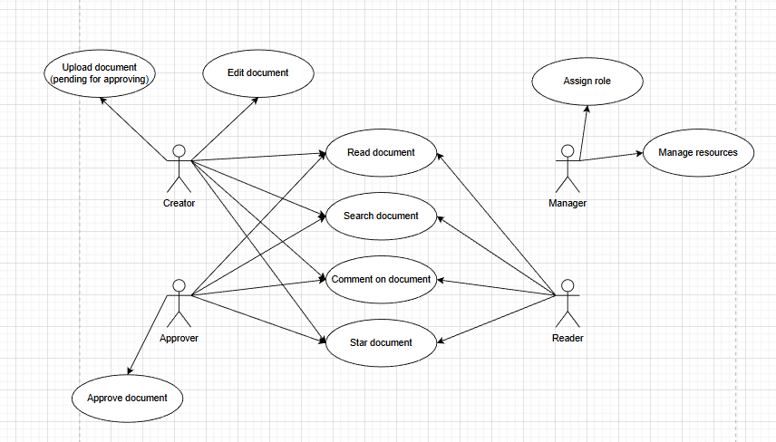
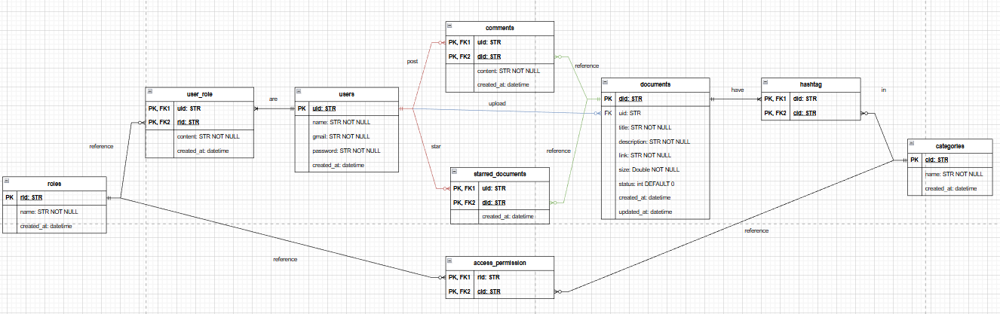

# Challenge 2 - Xây dựng ứng dụng quản lý tài liệu nội bộ của công ty
Kính gửi GS. Phạm Đình Lâm,

Challenge thứ 2 thiên về lập trình, do đó em đóng vai trò engineer để xây dựng kiến trúc, codebase và thiết kế các UI sketch tổng quan trước, sau đó em sử dụng AI để vibe code trên chính những thứ em đã chuẩn bị sẵn để có thể kiếm soát tốt nhất.

## Tổng quan
### 1. Ý tưởng
Em xây dựng ứng dụng này với mục đích nội bộ trong công ty nhằm quản lý các tài liệu, nhưng cũng có thể trở thành nơi mà các staff có thể đọc tài liệu. Em thiết kế để biến app này thiên theo 2 chiều chứ không chỉ các sếp vào lưu tài liệu là hết.

App được lấy cảm hứng thiên theo mạng xã hội, nơi những document được xem như những bài post, các manager cấp cao như những nhà kiểm duyệt nội dung trước khi cho phép nội dung được access tới mọi người, các staff như những người tiêu thụ document đầu cuối (tài liệu dev, tài liệu marketing, tài liệu nghiên cứu, ...) và toàn bộ mọi hoạt động và account đều nằm dưới sự kiểm soát của ông manager cao nhất.

### 2. Actor
Ở đây em sẽ chia các actor ra thành 4 loại chính:
- Creator: Là những người chủ yếu tạo các document, họ có thể là tech lead, manager, director, engineer, ...
- Approver: Là những người chuyên review các document đó để đề xuất chỉnh sửa, tối ưu nhất trước khi approve để xuất ra cho mọi người đọc.
- Reader: Là phần lớn người dùng của app, họ chủ yếu đọc các tài liệu (được giới hạn access bằng hashtag, họ không thể đọc hết toàn bộ document hiện có trên hệ thống).
- Manager: Là người có quyền lực nhất, họ chủ yếu nắm nhiệm vụ quản lý các account và tài tônguyên.

### 3. Use-case
Vì giới hạn thời gian nên em sẽ chỉ chủ yếu tập trung vào 10 most highest priority usecase, bao gồm:
- Common:
    - Authenticate: login, logout
    - Read document: Đọc các tài liệu (bị giới hạn document access dựa trên quyền hạn của accont đó)
    - Search document: Tìm kiếm các tài liệu liên quan
    - Comment on document: cho phép bình luận trên document đó với mục đích hỏi, trao đổi, ...
    - Star document: Dạng bookmark, dùng để lưu lại các document quan trọng (chỉ dành cho user đó).
- Creator:
    - Upload document: Đẩy tài liệu lên, nhưng chưa tới được với người dùng do chưa được duyệt.
    - Edit document: Chỉnh sửa tài liệu khi muốn update hoặc ghi lỗi (update lên cũng cần qua kiểm duyệt mới publish được).
- Approver:
    - Approve document: Chức năng này chia ra 2 loại chính đó là chấp nhận hoặc yêu cầu chỉnh sửa
- Manager:
    - Assign role: Chủ yếu quản lý phân quyền của từng người dùng để đưa họ vào từng chức năng
    - Manage resources: Kiểm soát ngưởi dùng và documents

### 4. Tech Stack
#### 4.1. Frontend
- Nextjs làm framework chính cho develop frontend
- Shadcn làm component framework để thống nhất vibe của các UI
- Tailwind làm css framework để tránh lỗi phức tạp css và tăng tốc độ dev

#### 4.2. Backend
- Fastapi làm framework chính cho develop backend
- PostgreSQL làm RDBMS để chứa dữ liệu

### 5. Cách dùng sourcecode
Ở đây em đã chuẩn bị sẵn `run.sh` rồi ạ, thầy chỉ cần chạy file này là có thể khởi động toàn bộ lên hết được ạ. Thêm một phần nữa là thầy cần tạo `.env` với DB endpoint như trong `.env.example` để có thể store và dùng data ạ.
Đây là video em đã chuẩn bị để demo challenge 2: [VIDEO HERE](https://youtu.be/9n0bww2yN8c)