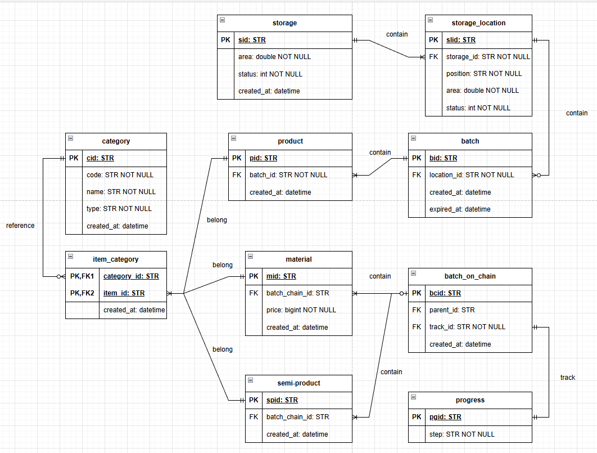
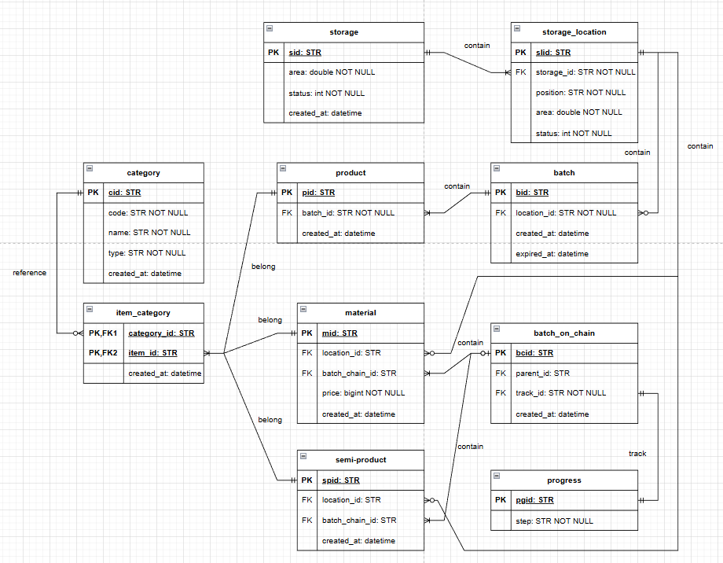
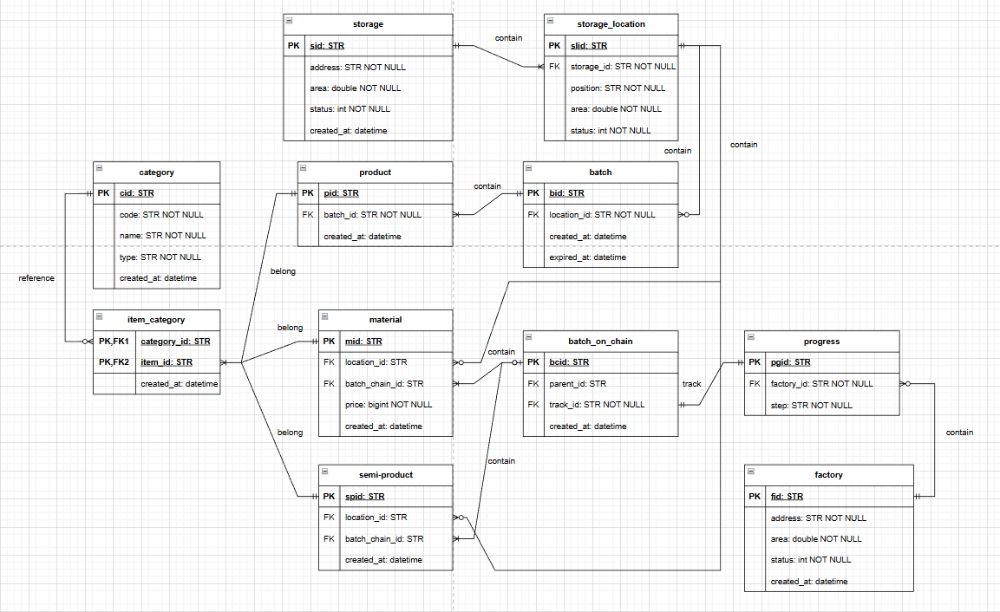

# Challenge 5 - Thiết kế CSDL cho hệ thống quản lý kho thông minh của một nhà máy sản xuất (Vinamilk)

Kính gửi GS. Phạm Đình Lâm,

Đối với bản thân em, đây là problem em thích nhất vì tính thực chiến và không dừng ở đó, đề còn yêu cầu tối ưu hết cỡ, do everything you can. Thêm một yếu tố quan trọng là problem này không yêu cầu code mà chỉ design, do đó với challenge này em **không** sử dụng AI 100%.

## Phạm vi hệ thống
Ở đây hệ thống yêu cầu chúng ta quản lý 7 vấn đề:
1. Nguyên liệu đầu vào (đường, bột béo, ...)
2. Sản phẩm bán thành phẩm (sữa chưa qua khử trùng, đường nấu, ...)
3. Thành phẩm (Các hộp sữa đóng bao hoàn chỉnh)
4. Quy trình sản xuất (nắm giữ được state hiện tại của batch sản phẩm bán thành phẩm hoặc nguyên liệu đang hoàn thành tới mức nào để xác định công việc tiếp theo)
5. Xuất nhập kho (quản lý được các nơi đi và đến của các thành phẩm)
6. Theo dõi lô hàng và hạn sử dụng (quản lý được từng batch thành phẩm, nắm HSD, có quan hệ mật thiết với xuất nhập kho)
7. Vị trí lưu kho (có quan hệ mật thiết với xuất nhập kho)

Theo góc nhìn cá nhân em, đây có lẽ là một nhà máy tự động hóa hoàn toàn (hoặc bán hoàn toàn) trên các chuỗi dây chuyền tự động. 

## Phạm vi bài toán:
Đây sẽ là phần em giới hạn phạm vi bài toán để tránh các vấn đề bùng nổ sâu hơn:
1. Giả định nhà máy không quan tâm vấn đề lưu dữ liệu của quá khứ dưới dạng versioning.
2. Giả định nhà máy không quan tâm nguyên liệu này được nhập từ nguồn/đối tác nào
3. Giả định nhà máy không quan tâm thành phẩm sẽ được bán/di chuyển qua đối tác khác

## Các giai đoạn thiết kế
Bởi vì kinh nghiệm thiết kế dữ liệu cũ của em khi được học trên trường sẽ là đi theo tuần tự, nhưng thực chiến thì sẽ bị xoắn các điều kiện với nhau, cho nên em lấy cảm hứng từ Agile-Scrum framework để thiết kế database này:
### Giai đoạn 1: Định nghĩa các thực thể cần có và mối quan hệ trong database
#### Vòng 1: Thiết kế thô
#### 1.1.1. Định nghĩa thực thể
Đầu tiên em xác định các thực thể cơ bản trong bài toán này vì đây là giai đoạn cực cực kì cần thiết đối với bài toán phức tạp. Với đặc thù bài toán và phạm vi yêu cầu như trên, em định nghĩa các thực thể bao gồm:
1. Nguyên liệu đầu vào
    - material
2. Sản phẩm bán thành phẩm
    - semi-product
3. Thành phẩm
    - product
4. Theo dõi lô hàng và hạn sử dụng (từng lô sẽ nắm các material/semi/product với cùng 1 status. Các hàng trong lô được xem là lỗi sẽ được loại bỏ ra sau khi nó thành product và đi qua vòng kiểm duyệt thất bại)
    - batch 
4. Quy trình sản xuất (Quy trình thường chạy theo từng lô, và status của từng lô sẽ phải được bind vào quy trình)
    - progress
    - batch_on_chain
5. Xuất nhập kho (quản lý được các nơi đi và đến của các thành phẩm)
    - storage
7. Vị trí lưu kho (là vị trí lô này nằm trong 1 kho nào đó, kho này cần phải có bảng để lưu được các vị trí kho)
    - storage_location

Sau khi phân tích 7 yêu cầu trên, ta có 8 thực thể chính cơ bản đó là: `material, semi-product, product, batch, batch_on_chain, progress, storage, storage_location`

#### 1.1.2. Định nghĩa field cho từng bảng:
Ta cần để từng bảng trả lời được các câu hỏi đơn giản và độc lập chỉ với mỗi bảng trước khi vòng 2 bắt đầu, bởi vì ta chưa xác định mối quan hệ giữa các bảng nên hiện tại chỉ xác định các trường độc lập
- material: cần trả lời được câu hỏi đây là nguyên liệu gì, giá bao nhiêu, nhập vào từ khi nào
    - `mid, category, price, created_at`
- semi-product: cần trả lời được câu hỏi bán thành phẩm này là loại gì, được tạo ra từ khi nào
    - `spid, category, created_at`
- product: cần trả lời được thành phẩm này được tạo ra khi nào
    - `pid, created_at`
- batch_on_chain: cần trả lời được lô này (gồm các nguyên liệu hoặc bán thành phẩm) được tạo từ khi nào
    - `bcid, created_at`
- batch: cần trả lời được lô này (gồm các thành phẩm) được tạo từ khi nào (NSX), khi nào hết hạn (HSD)
    - `bid, created_at, expired_at`
- progress: cần trả lời được hiện tại là tổng thể đang ở giai đoạn nào
    - `pgid, step`
- storage: cần trả lời được nơi này ở đâu, diện tích bao nhiêu, ngày tạo, trạng thái hoạt động
    - `sid, address, area, status, created_at`
- storage_location: cần trả lời được vị trí của nó nằm ở đâu, tình trạng của nó và cả diện tích của nó
    - `slid, position, area, status`

#### 1.1.3. Định nghĩa quan hệ
Tiếp theo đến định nghĩa quan hệ của từng thực thể, ở đây em nhận thấy rằng:
- batch_on_chain là tập hợp của material/semi-product, quan hệ `0..1 - 1..n`, batch thì chắc chắn phải có 1..n items, còn item thì thuộc về 1 batch hoặc không thuộc (mới nhập về chưa đưa vào).
- batch là tập hợp của các product, quan hệ `1 - 1..n`, 1 batch có thể chứa 1 hoặc nhiều product, và 1 product phải nằm trong 1 và chỉ 1 batch.
- storage_location là vị trí của cái batch đó, quan hệ `1 - 0..n`, storage_location có thể chứa 0 hoặc nhiều batch vẫn được tùy area của nó, và batch cũng có thể nằm ở 1 location duy nhất hoặc không (đang trong dây chuyền).
- storage là nơi mà storage_location được đặt, quan hệ `1 - 1..n`, storage là nhà kho chứa 1 hoặc nhiều storage_location, trong khi storage_location chỉ thuộc về 1 và chỉ 1 storage.
- progress là quy trình, dùng để nắm được trạng thái hiện tại của batch_on_chain, quan hệ `1 - 1`, progress quan sát 1 batch và 1 batch đang được 1 progress quan sát.

Do đó ta thêm các trường mới thể hiện tính quan hệ giữa từng thực thể:
- batch: cần trả lời được nó đang nằm ở đâu 
    - `bid, location_id, created_at, expired_at`
- batch_on_chain: cần trả lời được nó đang được theo dõi bới progress nào
    - `bcid, track_id, created_at`
- storage_location: cần trả lời được nó đang nằm ở storage nào
    - `slid, storage_id, position, area, status`
- product: cần trả lời được nó đang nằm trong batch nào
    - `pid, batch_id, created_at`
- material: cần trả lời được nó đang nằm trong batch chain nào
    - `mid, batch_chain_id, category, price, created_at`
- semi-product: cần trả lời được nó đang nằm trong batch chain nào
    - `spid, batch_chain_id, category, created_at`

#### 1.1.4. Thành quả vòng 1

#### Vòng 2: Tinh chỉnh batch_on_chain
#### 1.2.1. Vấn đề từ vòng 1
Ta có thể nhận thấy rằng với ERD trên, có nhược điểm ở batch_on_chain. Nếu quy trình là dạng đa luồng thay vì tuần tự thì sao (sữa đi một nhánh, gia vị đi nhánh khác xử lý song song), với vấn đề này thì ERD này sẽ die, do đó ta cần refine ở chỗ batch_on_chain này.
#### 1.2.2. Solution
Ta sẽ sử dụng cơ chế batch đẻ batch ở đây để giải quyết vấn đề. Cụ thể là đưa về bài toán gối nhau. Nếu gặp bài toán 2 luồng thì tự thân batch_on_chain này sẽ tự lưu chính nó thành 2 bản khác nhưng trỏ về bản gốc, tại bản con đó sẽ trỏ tới các items trong nhánh con đó. Từ đó ta có thể giải quyết vấn đề này theo dạng chia để trị.
Ở đây em sẽ thêm `parent_id` làm self-FK vào batch_on_chain với mục đích truy được parent theo từng nhánh. Với cách này thì giờ đây có thể handle được các trường hợp hierachical chain.

#### Vòng 3: Hỗ trợ mở rộng các loại nguyên liệu/thành phẩm mới
#### 1.3.1. Vấn đề từ các vòng trước
Ở 2 vòng trước, em nhận thấy rằng trường `category` ở material, product đều là STR, có thể điền tự do và khó quản lý 1 cách toàn diện. Phía product thì không phân loại được sản phẩm đó là gì. Do đó mục đích của vòng 3 này là để củng cố lại vấn đề nêu trên.
#### 1.3.2. Solution
Vì muốn thêm khả năng phân loại tốt, cho nên em thêm một bảng category: `cid, code, name, type, created_at`. Mục tiêu của em là để khái niệm nguyên liệu và bán thành phẩm trở nên flexible hơn. Do đó, 1 material có thể có nhiều category (eg. #material, #refined, #sugar, ...) và 1 semi-product cũng có thể có nhiều category (eg. #semi, #pasteurized, #sizeL, ...). Phía product cũng nên có chế độ đa category (eg. #sizeL, #canned, #nosugar, ...). Để giải quyết được vấn đề trên em chọn cách tạo 1 bảng trung gian item_category: `category_id, item_id, created_at`. Mối quan hệ chúng ta có sau khi thay đổi như sau:
- category là tham chiếu của item_category, quan hệ `1 - 0..n`, một category có thể không tham gia xuất hiện trong chuỗi vận hành (vừa mới tạo hoặc hiếm khi xuất hiện như #error) và bắt buộc trong item_category row phải có 1 và chỉ 1 category.
- product, material, semi-product (gọi chung là item) sở hữu các category là item_category, quan hệ `1 - 1..n`, mỗi item_category row chỉ có thể chứa 1 và chỉ 1 item, nhưng mỗi item có thể chứa nhiều nhãn.
Sau khi xác định thực thể, fields và mối quan hệ giữa chúng, đây là kết quả:

 

#### Vòng 4: Hỗ trợ đa nhà máy, chỉnh sửa lỗi sai logic
#### 1.4.1. Lỗi logic lưu trữ nguyên liệu, bán thành phẩm
Với ERD trên, nguyên liệu mới nhập và bán thành phẩm để chờ sẽ không có chốn dung thân. Để giải quyết vấn đề này, em sẽ tạo thêm mối quan hệ và FK cho material, semi-product:
- storage_location là vị trí của material đó, quan hệ `1 - 0..n`, storage_location có thể chứa 0 hoặc nhiều material vẫn được tùy area của nó, và material cũng có thể nằm ở 1 location duy nhất hoặc không (đang trong dây chuyền).
- storage_location là vị trí của semi-product đó, quan hệ `1 - 0..n`, storage_location có thể chứa 0 hoặc nhiều semi-product vẫn được tùy area của nó, và material cũng có thể nằm ở 1 location duy nhất hoặc không.

#### 1.4.2. Hỗ trợ đa nhà máy
Em nhận thấy rằng database của mình hiện chỉ hỗ trợ đúng 1 nhà máy duy nhất. Để hỗ trợ việc phát triển thêm nhiều nhà máy khác nhau, việc đầu tiên của chúng ta là tạo 1 bảng để nắm thông tin các nhà máy
- factory: `fid, address, area, status, created_at`
Tiếp theo chúng ta sẽ xác định quan hệ của bảng factory. Một nhà máy sẽ phục vụ mục đích nắm giữ dây chuyền và sản xuất thành phẩm. Do đó factory sẽ có mối quan hệ mật thiết với progress, quan hệ của 2 bảng này là `1 - 0..n`, 1 factory có thể có nhiều progress dây chuyền chạy hoặc không có (ngày nghỉ, bảo dưỡng), còn 1 progress khi vận hành thì chỉ thuộc về 1 và chỉ 1 factory.

### Giai đoạn 2: Xác định chiến thuật tối ưu truy vấn
Database chạy được chưa chắc là một database tốt, do đó việc đầu tiên em làm để xác định được chỗ nào cần apply index và scan đó là xác định các công việc được thực thi với tần suất cao và số lượng record khổng lồ.
#### 2.1. Xác định các case dùng thường xuyên
- Đối với bảng category, storage, factory thì số lượng record không nhiều tới mức cần phải áp dụng index cho nên em sẽ ignore 3 bảng này. 
- Các cánh tay robot cần phải nhận diện vật thể trên dây chuyền là gì (thông qua máy quét vạch QR và có mã QR dán lên trên item), phân loại của nó là gì, đang ở công đoạn nào một cách liên tục tần suất cực cao. Và đây là chỗ em thấy cần phải optimize mạnh nhất để tăng tốc dây chuyền.
- Khi các thành phẩm vào nhà kho, ta cần phải xuất các đơn hàng có ngày hết hạn gần nhất ưu tiên ra trước tiên. Do đó đây là một bài toán sắp xếp.
#### 2.2. Xác định index
- Đối với vấn đề cánh tay robot thì bài toán ở đây là tìm giá trị chính xác, cho nên em sẽ dùng hash index `item_id` cho item_category ở đây. Tăng tốc độ fetch chính xác các category từ O(n) về O(1) và insert cũng O(1) nhưng chậm hơn 1 xíu do thuật toán hash. Đối với 3 bảng material, semi-product và product cũng sử dụng query exact seek cực nhiều. Cụ thể cánh tay robot cũng sẽ phải quét và xem xem vật thể trên dây chuyền là gì cho nên 3 bảng này em cũng dùng hash index cho `pid | spid | mid` để tăng tốc độ search vật thể.
- Về vấn đề đối mặt với tồn kho và chiến thuật xuất thành phẩm đi bán thì em sử dụng b-tree index lên `expired_date` của batch để đẩy các batch có HSD thấp qua bên trái của cây, sau đó chỉ cần lấy top-k HSD thấp nhất đem đi join với storage_location và join với storage là có thể biết được vị trí của mặt hàng cần xử lý và giao cho robot bốc hàng. Bên cạnh đó để đề phòng mỗi storage có diện tích cực lớn chứa hàng nghìn, trăm nghìn slot chứa thì em apply luôn hash index lên `slid` của storage_location để đưa về tốc độ exact seek = O(1).
#### 2.3. Adaptive Query Optimization
Đây là một section đánh thẳng vào vấn đề tăng trưởng dữ liệu. Vấn đề đoán sai cardinality cho mỗi node trong query plan tree là 1 vấn đề nhức nhối trong các hệ thống RDBMS hiện tại. Ví dụ với PostgreSQL thì với histogram approach cũ có khi dẫn tới sai số estimated cardinality so với cardinality thật lên tới vài con số 0, việc này dẫn đến cost calculator bị hoang tưởng và chọn sai best plan. Ở trong bài toán của chúng ta, vấn đề chọn nhầm best plan do bộ cardinality estimator tính toán sai có thể bóp chết hiệu suất ở các query join nhiều bảng cực lớn với nhau. Do đó để xử lý vấn đề chọn nhầm thuật toán scan và join do cardinality estimator bị sai. Em apply thuật toán KNN vào trong cardinality estimator. Điều này giúp hệ thống tự học được từ những sai lầm của nó và estimate cardinality đúng hơn sau vài vòng lặp va chạm. Cách này của em lấy ý tưởng từ bài báo [Adaptive Query Optimization của Oleg Ivanov](https://arxiv.org/pdf/1711.08330). Và em cũng đã phát triển thuật toán này theo hướng adaptive K bởi vì cách của họ chỉ sử dụng K cố định (thực nghiệm set k=3), bài báo của em đã được accept ở hội nghị ICIIT 2026 - Ei Compendex.