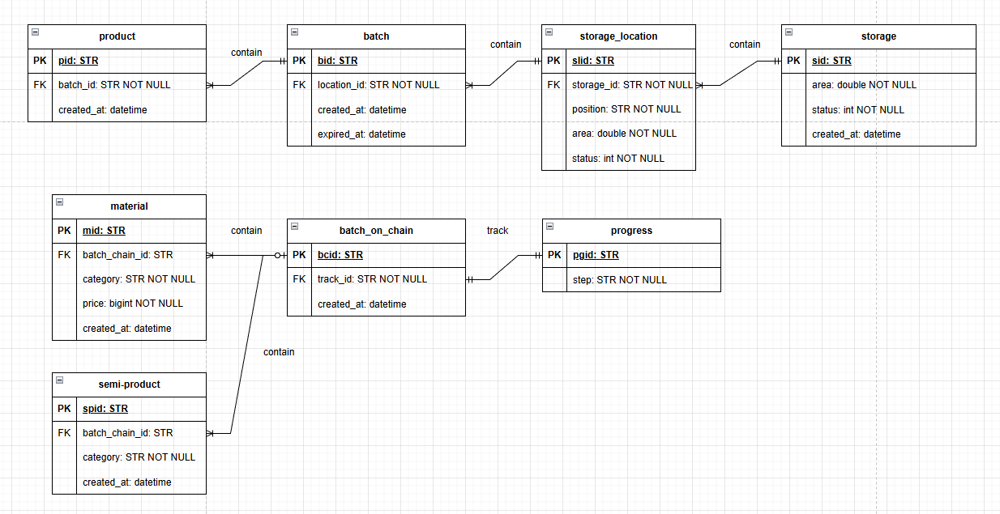
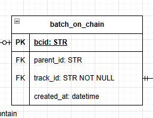

# Challenge 5 - Thiết kế CSDL cho hệ thống quản lý kho thông minh của một nhà máy sản xuất (Vinamilk)

Kính gửi GS. Phạm Đình Lâm,

Đối với bản thân em, đây là problem em thích nhất vì tính thực chiến và không dừng ở đó, đề còn yêu cầu tối ưu hết cỡ, do everything you can. Thêm một yếu tố quan trọng là problem này không yêu cầu code mà chỉ design, do đó với challenge này em **không** sử dụng AI 100%.

## Phạm vi hệ thống
Ở đây hệ thống yêu cầu chúng ta quản lý 7 vấn đề:
1. Nguyên liệu đầu vào (đường, bột béo, ...)
2. Sản phẩm bán thành phẩm (sữa chưa qua khử trùng, đường nấu, ...)
3. Thành phẩm (Các hộp sữa đóng bao hoàn chỉnh)
4. Quy trình sản xuất (nắm giữ được state hiện tại của batch sản phẩm bán thành phẩm hoặc nguyên liệu đang hoàn thành tới mức nào để xác định công việc tiếp theo)
5. Xuất nhập kho (quản lý được các nơi đi và đến của các thành phẩm)
6. Theo dõi lô hàng và hạn sử dụng (quản lý được từng batch thành phẩm, nắm HSD, có quan hệ mật thiết với xuất nhập kho)
7. Vị trí lưu kho (có quan hệ mật thiết với xuất nhập kho)

Theo góc nhìn cá nhân em, đây có lẽ là một nhà máy tự động hóa hoàn toàn (hoặc bán hoàn toàn) trên các chuỗi dây chuyền tự động. 

## Phạm vi bài toán:
Đây sẽ là phần em giới hạn phạm vi bài toán để tránh các vấn đề bùng nổ sâu hơn:
1. Giả định nhà máy chỉ sản xuất 1 loại sữa cùng size
2. Giả định nhà máy không quan tâm vấn đề versioning
3. Giả định nhà máy không quan tâm nguyên liệu này được nhập từ nguồn/đối tác nào
4. Giả định nhà máy không quan tâm thành phẩm sẽ được bán/di chuyển qua đối tác khác

## Các giai đoạn thiết kế
Bởi vì kinh nghiệm thiết kế dữ liệu cũ của em khi được học trên trường sẽ là đi theo tuần tự, nhưng thực chiến thì sẽ bị xoắn các điều kiện với nhau, cho nên em lấy cảm hứng từ Agile-Scrum framework để thiết kế database này:
### Giai đoạn 1: Định nghĩa các thực thể cần có và mối quan hệ trong database
#### Vòng 1: Thiết kế thô
#### 1.1. Định nghĩa thực thể
Đầu tiên em xác định các thực thể cơ bản trong bài toán này vì đây là giai đoạn cực cực kì cần thiết đối với bài toán phức tạp. Với đặc thù bài toán và phạm vi yêu cầu như trên, em định nghĩa các thực thể bao gồm:
1. Nguyên liệu đầu vào
    - material
2. Sản phẩm bán thành phẩm
    - semi-product
3. Thành phẩm
    - product
4. Theo dõi lô hàng và hạn sử dụng (từng lô sẽ nắm các material/semi/product với cùng 1 status. Các hàng trong lô được xem là lỗi sẽ được loại bỏ ra sau khi nó thành product và đi qua vòng kiểm duyệt thất bại)
    - batch 
4. Quy trình sản xuất (Quy trình thường chạy theo từng lô, và status của từng lô sẽ phải được bind vào quy trình)
    - progress
    - batch_on_chain
5. Xuất nhập kho (quản lý được các nơi đi và đến của các thành phẩm)
    - storage
7. Vị trí lưu kho (là vị trí lô này nằm trong 1 kho nào đó, kho này cần phải có bảng để lưu được các vị trí kho)
    - storage_location

Sau khi phân tích 7 yêu cầu trên, ta có 8 thực thể chính cơ bản đó là: `material, semi-product, product, batch, batch_on_chain, progress, storage, storage_location`

#### 1.2. Định nghĩa field cho từng bảng:
Ta cần để từng bảng trả lời được các câu hỏi đơn giản và độc lập chỉ với mỗi bảng trước khi vòng 2 bắt đầu, bởi vì ta chưa xác định mối quan hệ giữa các bảng nên hiện tại chỉ xác định các trường độc lập
- material: cần trả lời được câu hỏi đây là nguyên liệu gì, giá bao nhiêu, nhập vào từ khi nào
    - `mid, category, price, created_at`
- semi-product: cần trả lời được câu hỏi bán thành phẩm này là loại gì, được tạo ra từ khi nào
    - `spid, category, created_at`
- product: cần trả lời được thành phẩm này được tạo ra khi nào
    - `pid, created_at`
- batch_on_chain: cần trả lời được lô này (gồm các nguyên liệu hoặc bán thành phẩm) được tạo từ khi nào
    - `bcid, created_at`
- batch: cần trả lời được lô này (gồm các thành phẩm) được tạo từ khi nào (NSX), khi nào hết hạn (HSD)
    - `bid, created_at, expired_at`
- progress: cần trả lời được hiện tại là tổng thể đang ở giai đoạn nào
    - `pgid, step`
- storage: cần trả lời được nơi này ở đâu, diện tích bao nhiêu, ngày tạo, trạng thái hoạt động
    - `sid, location, area, status, created_at`
- storage_location: cần trả lời được vị trí của nó nằm ở đâu, tình trạng của nó và cả diện tích của nó
    - `slid, position, area, status`

#### 1.3. Định nghĩa quan hệ
Tiếp theo đến định nghĩa quan hệ của từng thực thể, ở đây em nhận thấy rằng:
- batch_on_chain là tập hợp của material/semi-product, quan hệ `0..1 - 1..n`, batch thì chắc chắn phải có 1..n items, còn item thì thuộc về 1 batch hoặc không thuộc (mới nhập về chưa đưa vào).
- batch là tập hợp của các product, quan hệ `1 - 1..n`, 1 batch có thể chứa 1 hoặc nhiều product, và 1 product phải nằm trong 1 và chỉ 1 batch.
- storage_location là vị trí của cái batch đó, quan hệ `1 - 0..n`, storage_location có thể chứa 0 hoặc nhiều batch vẫn được tùy area của nó, và batch cũng có thể nằm ở 1 location duy nhất hoặc không (đang trong dây chuyền).
- storage là nơi mà storage_location được đặt, quan hệ `1 - 1..n`, storage là nhà kho chứa 1 hoặc nhiều storage_location, trong khi storage_location chỉ thuộc về 1 và chỉ 1 storage.
- progress là quy trình, dùng để nắm được trạng thái hiện tại của batch_on_chain, quan hệ `1 - 1`, progress quan sát 1 batch và 1 batch đang được 1 progress quan sát.

Do đó ta thêm các trường mới thể hiện tính quan hệ giữa từng thực thể:
- batch: cần trả lời được nó đang nằm ở đâu 
    - `bid, location_id, created_at, expired_at`
- batch_on_chain: cần trả lời được nó đang được theo dõi bới progress nào
    - `bcid, track_id, created_at`
- storage_location: cần trả lời được nó đang nằm ở storage nào
    - `slid, storage_id, position, area, status`
- product: cần trả lời được nó đang nằm trong batch nào
    - `pid, batch_id, created_at`
- material: cần trả lời được nó đang nằm trong batch chain nào
    - `mid, batch_chain_id, category, price, created_at`
- semi-product: cần trả lời được nó đang nằm trong batch chain nào
    - `spid, batch_chain_id, category, created_at`

#### 1.4. Thành quả vòng 1

#### Vòng 2: Tinh chỉnh batch_on_chain
#### 2.1. Vấn đề từ vòng 1
Ta có thể nhận thấy rằng với ERD trên, có nhược điểm ở batch_on_chain. Nếu quy trình là dạng đa luồng thay vì tuần tự thì sao (sữa đi một nhánh, gia vị đi nhánh khác xử lý song song), với vấn đề này thì ERD này sẽ die, do đó ta cần refine ở chỗ batch_on_chain này.
#### 2.2. Solution
Ta sẽ sử dụng cơ chế batch đẻ batch ở đây để giải quyết vấn đề. Cụ thể là đưa về bài toán gối nhau. Nếu gặp bài toán 2 luồng thì tự thân batch_on_chain này sẽ tự lưu chính nó thành 2 bản khác nhưng trỏ về bản gốc, tại bản con đó sẽ trỏ tới các items trong nhánh con đó. Từ đó ta có thể giải quyết vấn đề này theo dạng chia để trị.
Ở đây em sẽ thêm `parent_id` làm self-FK vào batch_on_chain với mục đích truy được parent theo từng nhánh. Với cách này thì giờ đây có thể handle được các trường hợp hierachical chain.

#### Vòng 3: Hỗ trợ mở rộng các loại sản phẩm mới
#### 

### Giai đoạn 5: Xác định Index
### Giai đoạn 6: Xác định thuật toán scan cho các câu query có join phức tạp