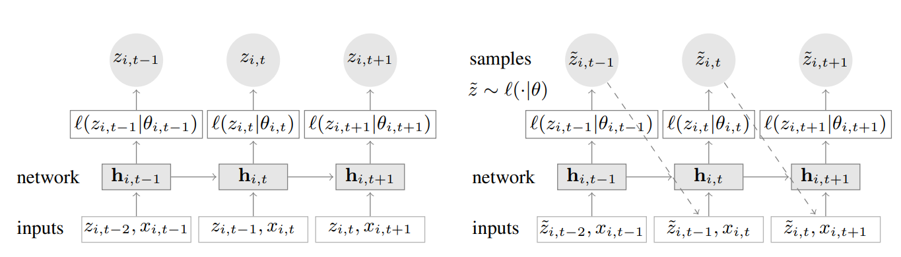
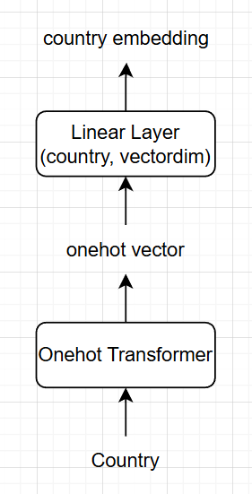

# Challenge 6 - Thiết kế ứng dụng AI cho dự đoán dân số của mỗi quốc gia trên toàn thế giới
Kính gửi GS. Phạm Đình Lâm,

Đối với em, sở trường mạnh nhất của em là ở challenge này. Dữ liệu em lấy từ [World Population Prospects 2024](https://www.kaggle.com/datasets/willianoliveiragibin/world-population-prospects-2024?resource=download) với tổng cộng 18944 records của 256 quốc gia trên toàn thế giới (có tính cả toàn thế giới, bên kia xích đạo, ...) bao phủ từ năm 1950 đến năm 2023. Trong đó bao gồm 3 cột thông tin chính đó là `country`, `year` và `population`. Trong challenge này em chỉ sử dụng AI để hỗ trợ code, còn lại các vấn đề kiến trúc hóa và idea em tự làm 100%.

## Giới thiệu bài toán 
Đây là bài toán multiple time-series trong đó ta phải tối thiểu hóa loss mà không đè chân mỗi quốc gia với nhau. Em prefer cách ta train 1 global model hơn là việc bẻ nhỏ ra thành n models khác nhau

## Kiến trúc đề xuất cho bài toán hiện tại
Lấy kiến trúc từ [DeepAR của Amazon](https://arxiv.org/pdf/1704.04110). Mô hình chủ đạo sẽ xoay quanh LSTM và Gaussian likelihood function. Lý do em chọn model này là vì khả năng học được multiple objects và nó còn tìm được mối quan hệ giữa mỗi object, rất tuyệt vời khi có dữ liệu mới của 1 nước mà ít, nó sẽ nhận thấy nước này same same với nước nào đó nó đã học và infer theo. Theo như paper, họ muốn dùng LSTM thay vì GRU vì LSTM có độ ổn định tốt hơn. Còn lý do họ áp dụng Gaussian vì tương lai là bất định, tư duy này còn được áp dụng trong các World Model sơ khai (David Ha 2018) và các World Model tân tiến hiện nay. Cụ thể em sẽ kiến trúc để đi theo luồng như dưới đây

Trong đó figure ở phía bên trái là quá trình training còn bên phải là quá trình inference. 
- Training: Khác với traditional model, LSTM ở đây nhận luôn cả target ở quá khứ trước đó 1 step và đưa vào LSTM để lấy hidden state. Tiếp theo hidden state này sẽ là input để infer ra std và mean trong Gaussian Norm. Tiếp đến là hành vi học của model, ta sử dụng NLL loss kẹp PDF làm chủ đạo. Hàm NLL sẽ cố gắng tối đa hóa xác suất của hàm PDF trong khi hàm PDF thì lại cố gắng đẩy mean và std sao cho giá trị `z` tại PDF là cao nhất. Nhìn vào figure thì ta có thể thấy có biến `x`, biến này chính là covariate (ở bài toán của mình sẽ là `country` và `year`). Về chuỗi input data, em chọn `window=10` (10 năm liên tiếp của mỗi quốc gia), nghĩa là trong memory sẽ stack 10 LSTM cell nối nhau như trong figure trên. 
- Inference: Đây sẽ là nơi thực hiện dự đoán tương lai thật sự. Em chia ra thành 2 phần là bước đệm và mơ. Giả sử dự đoán dân số năm 2026 của VN thì em sẽ lấy bước đệm từ 2014 tới 2023 (vì dữ liệu đã biết hiện tại chỉ ở 2023), sau đó sẽ thực hiện việc mơ tới các năm tương lai chịu tác động bới Gauss Distribution cho tới khi đạt được tới năm mong muốn.

Một điểm đặc biệt ở đây nữa mà trong paper không nhắc tới đó là `country` trong dữ liệu dạng text cho nên em cần thêm 1 chút kiến trúc để hỗ trợ text trong DeepAR

## Thực nghiệm
Ở đây em sẽ thực nghiệm để chứng minh phương pháp của em chọn là hiệu quả, nhưng thời gian không cho phép nên em sẽ làm phần thực nghiệm này ít.
#### Baseline models
Với baseline model, em chọn: 
- Single time series model với traditional LSTM chỉ học 1 nước.
- Multiple time series model nhưng input của LSTM chỉ có `country` và `year`, output ra `population`.

#### Dữ liệu thực nghiệm
Em chọn dữ liệu đã nêu ở phần đầu bài viết, trong đó em chia train:valid:test thành 70:10:20. Đối với model đề xuất đấu với single time series thì em chỉ cho 2 model này test trên 1 quốc gia (được lọc ra trong test set). Còn khi model đề xuất đấu với model còn lại thì em cho nó test trên bộ test chuẩn. Điều này mang tính công bằng.

#### Thiết lập thực nghiệm
Mô hình LSTM trong thực nghiệm này em chọn cấu hình là:
- Số layer của LSTM: 2 (không bidirectional do dữ liệu có tính tiến lên chứ không ngoảnh đầu)
- Country embedding dim: 32
- Year embedding dim: 8
- Input của LSTM: 32 + 8 + 1 (1 ở đây là population đã normalized)

Trainable Params:
- Ma trận chứa embedding của `country`
- Ma trận chứa embedding của `year`
- LSTM model
- Ma trận của std và mean

Training config:
- Epoch: 150
- Lr: 1e-3
- Batch size: 128
- Gradient clipping: 10
- Trọng số hãm weight phình to: 1e-5

#### Kết quả thực nghiệm
| Criteria | DeepAR | Multiple LSTM | Single LSTM |
| --------- | --------- | --------- | --------- |
| RMSE    | 3,013,301.39 | 2,789,425.04 | 4,376,917.02
| MAE    | 2,881,240.40 | 1,692,210.49 | 3,876,480.24

Từ bảng trên ta có thể thấy rằng Multiple LSTM mạnh nhất overall, mạnh hơn cả DeepAR. Trong code của em không sử dụng seed cố định cho nên có thể thấy rằng Multi LSTM ăn hên rơi gần điểm minimum tốt và nó nghe theo gradient vector để lăn tới đó chứ paper đã thực nghiệm nên không thể Multi LSTM mạnh hơn DeepAR. Một ý tưởng để enhance thực nghiệm đó là chạy trên 5-10 seed cố định mỗi loại sau đó lấy mean, std kết quả mỗi model để xác định average performance và sự lay động của kết quả hoặc sử dụng bộ model weight của các seed đó rồi tính Euclid distance xem model nào có khoảng cách bé hơn -> ổn định hơn.

## Kiến trúc phần mềm
Sau khi đã huấn luyện được mô hình và pipeline, em tổ chức app dưới dạng frontend - backend. Trong đó frontend chủ đạo sử dụng NextJS và backend sử dụng FastAPI. Phía backend sẽ chạy trained AI model và chờ request đến từ frontend để đưa input vào pipeline và infer ra kết quả trả về cho frontend.

## Cách sử dụng sourcecode
Em đã chuẩn bị sẵn file `run.sh` ở trong challenge này để thầy có thể chạy ngay rồi ạ, em cũng có chuẩn bị sẵn video: [VIDEO HERE](https://youtu.be/3WOt7VlKOyk)